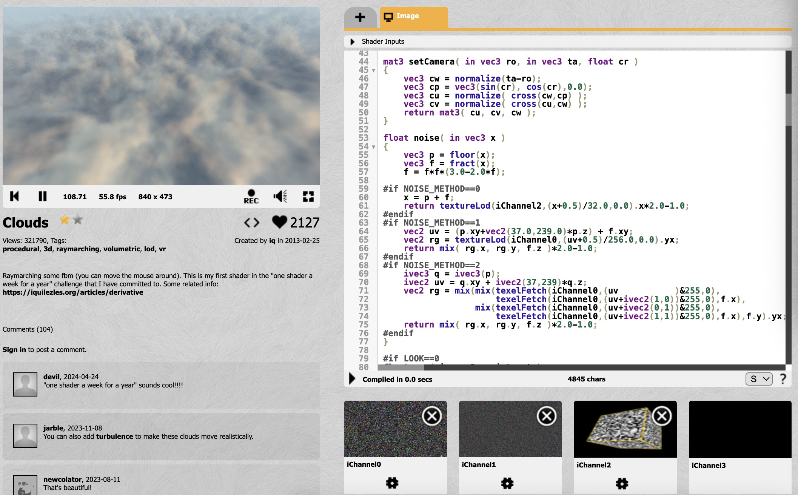

# dzhe0035_9103_tut6

- Part 1: Imaging Technique Inspiration
    - I was inspired by the imaging technique of layering and texturing in visual artist Refik Anadol's work Melting Memories.
    - By layering and dynamically adjusting large amounts of data, it is possible to create fluid, multi-layered visuals that visually build a sense of depth and space. At the same time, texture helps to bring out the detail and complexity generated by the data in our work, as each data point is translated into visual textural detail. These help us refine the details of the final imaging and give better visualization.
    - 
    

- Part 2: Coding Technique Exploration
    - To achieve layered and textured effects, we can use the very powerful technique of Fragment Shaders. Fragment shaders are programs used in graphics programming to handle pixel-level rendering. They can control the color and texture effects of an image at a very detailed level, and are ideal for achieving complex visual effects.
    - Fragment shaders can use texture mapping techniques to apply images or textures to 3D models. By adjusting texture coordinates and sampling methods, rich visual textures and layers can be created. Textures can also be generated in the fragment shader using Perlin noise or Simplexx's noise function. This method can be used in our assignments to create natural and organic visual effects such as smoke, water, and cloud textures. However fragment shaders are usually used in OpenGL, WebGL (e.g. through the Three.js library), or other environments that support GLSL.
    - 
    example implementation:
    [Dynamic cloud textures](https://www.shadertoy.com/view/XslGRr)
